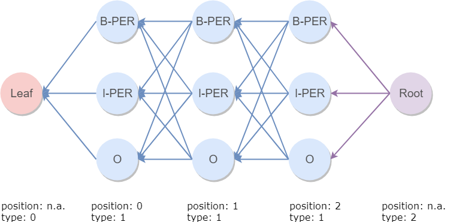

# Graphical Model: build customized graphical model

In this section, we are going to build the network compiler to tell StatNLP: given an instance, what network (labeled or unlabeled) is going to be built and what does it look like. The following code is under `examples/linear_ner/compiler.py`. The usage is actually same as the Java framework where we have to implement the following three functions.
1. [compile_labeled](#Compile-labeled-network): the function to compile labeled network
2. [compile_unlabeled](#Compile-unlabeled-network): the function to compile the unlabeled network
3. [decompile](#Decompile-(Decode)): the function to extract the prediction.

These three functions are __essential and compulsory__ for every model to implement. Before implementing these three functions, we need to implement the constructor functions and define the node in the networks.

## Initilaize a compiler
We initialie the network compiler inheriting the `NetworkCompiler` class with the following steps:
1. pass the label map to the compiler (i.e., `{"B-PER": 0, "O":1, ...}`). We will use it later.
2. Set the capacity of the network as in Java framework.
3. Build the generic network (later) shared across different sentence length

```python
from hypergraph.NetworkCompiler import NetworkCompiler
from hypergraph.NetworkIDMapper import NetworkIDMapper
from hypergraph.TensorBaseNetwork import TensorBaseNetwork
import numpy as np
from typing import Dict
class NERNetworkCompiler(NetworkCompiler):

    def __init__(self, label_map: Dict, max_size:int = 20):
        super().__init__()
        self.labels = [None] * len(label_map)
        self.label2id = label_map
        for key in self.label2id:
            self.labels[self.label2id[key]] = key

        NetworkIDMapper.set_capacity(np.asarray([max_size, len(self.labels), 3], dtype=np.int64))

        print("Building generic network..")
        self.build_generic_network(max_size)
```

## Graphical Representation
Before jumping into the actual implementation of network compiler, let's look at the labeled network and unlabeled network representation of the linear-chain CRF.




We need to define the nodes in the above figure. 

## Defining the nodes.
Define the node using `position`, `label id` and `node_type`. Because this information uniquely identify a node in a network. Basically, we encode the information into a numpy array and StatNLP will encode them as a `long` value. 

__Note__: it is not valid to switch the position of `position` and `label_id`, from `[pos, label_id, type]` to `[label_id, pos, type]`. Because when we build the network in StatNLP, we always have to ensure the consistence that the parent node should have a larger value then the children nodes. 

```python
    def to_node(self, pos, label_id, node_type):
        return NetworkIDMapper.to_hybrid_node_ID(np.asarray([pos, label_id, node_type]))

    def to_root(self, size):
        return self.to_node(size - 1, len(self.labels) - 1, 2)

    def to_tag(self, pos, label_id):
        return self.to_node(pos, label_id, 1)

    def to_leaf(self, ):
        return self.to_node(0, 0, 0)

```

## Build the Generic Network
As in the Java framework, we can have a generic network that share across different unlabeled networks. 
```python
    def build_generic_network(self):
        builder = TensorBaseNetwork.NetworkBuilder.builder()
        leaf = self.to_leaf()
        builder.add_node(leaf)
        children = [leaf]
        for i in range(self._max_size):
            current = [None for k in range(len(self.labels))]
            for l in range(len(self.labels)):
                tag_node = self.to_tag(i, l)
                builder.add_node(tag_node)
                for child in children:
                    builder.add_edge(tag_node, [child])
                current[l] = tag_node
            children = current
            root = self.to_root(i+1)
            builder.add_node(root)
            for child in children:
                builder.add_edge(root, [child])
        self._all_nodes, self._all_children, self.num_hyperedge = builder.pre_build()
```
The member returned by the `pre_build` functions are going to be used later in `compile_unlabeled_network`.

## Compile labeled network
Extract the labels in the gold output and build the labeled network. 
```python
    def compile_labeled(self, network_id, inst, param):

        builder = TensorBaseNetwork.NetworkBuilder.builder()
        leaf = self.to_leaf()
        builder.add_node(leaf)
        output = inst.get_output()
        children = [leaf]
        for i in range(inst.size()):
            label = output[i]
            tag_node = self.to_tag(i, self.label2id[label])
            builder.add_node(tag_node)
            builder.add_edge(tag_node, children)
            children = [tag_node]
        root = self.to_root(inst.size())
        builder.add_node(root)
        builder.add_edge(root, children)
        network = builder.build(network_id, inst, param, self)
        return network
```

## Compile unlabeled network
We directly extract a subnetwork from the generic network.
```python
    def compile_unlabeled(self, network_id, inst, param):
        builder = TensorBaseNetwork.NetworkBuilder.builder()
        root_node = self.to_root(inst.size())
        all_nodes = self._all_nodes
        root_idx = np.argwhere(all_nodes == root_node)[0][0]
        node_count = root_idx + 1
        network = builder.build_from_generic(network_id, inst, self._all_nodes, self._all_children, node_count, self.num_hyperedge, param, self)
        return network

```

## Decompile (Decode)
Extract the prediction label sequence after the MAP inference (i.e. Viterbi).
```python
    def decompile(self, network):
        inst = network.get_instance()
        size = inst.size()
        root_node = self.to_root(size)
        all_nodes = network.get_all_nodes()
        curr_idx = np.argwhere(all_nodes == root_node)[0][0] #network.count_nodes() - 1 #self._all_nodes.index(root_node)
        prediction = [None for i in range(size)]
        for i in range(size):
            children = network.get_max_path(curr_idx)
            child = children[0]
            child_arr = network.get_node_array(child)
            prediction[size - i - 1] = self.labels[child_arr[1]]
            curr_idx = child
        inst.set_prediction(prediction)
        return inst
```
